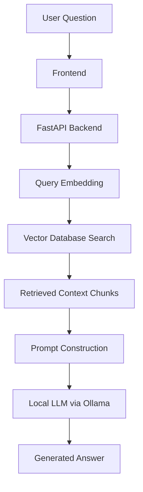

# 🧠 Retrieval-Augmented Generation (RAG) System

A local document question-answering system that allows users to upload private documents and ask natural language questions. The system retrieves relevant context from documents and uses a local LLM to generate grounded, context-aware answers.

---

## 🎯 What this project does

This system enables semantic search and question answering over private documents without relying on external APIs. It is designed as an end-to-end RAG pipeline with evaluation to ensure response quality and factual grounding.

---

## 🌟 Highlights
- 🧠 End-to-end Retrieval-Augmented Generation (RAG) pipeline
- 🔎 Semantic search using dense embeddings (not keyword-based search)
- 📄 PDF ingestion with structured text chunking for unstructured documents
- 💬 Context-grounded LLM responses to reduce hallucinations
- 🔐 Local-first inference using Ollama for data privacy
- - 📊 Coming soon: RAG evaluation using Ragas metrics such as faithfulness, relevance, and precision

---

## ℹ️ Overview

This is a practice project focused on building an end-to-end Retrieval-Augmented Generation (RAG) system for working with private document collections.

The system allows users to ask questions about uploaded documents and receive answers based on the actual content retrieved from those documents. It combines semantic search with a locally running LLM, allowing responses to be generated using relevant retrieved context rather than relying solely on the model's general knowledge.

The project explores practical RAG use cases such as internal document search, knowledge assistants, and working with unstructured data.

The main goal of this project is to develop and demonstrate practical skills in building LLM-powered applications, including document ingestion, text chunking, embeddings, semantic retrieval, vector databases, and local LLM inference.

---

## ✍️ Authors

Chelsea Khor  
GitHub: https://github.com/celseakr

---

## 🚀 Setup & Execution
1. Clone repository 
```bash
git clone https://github.com/celseakr/RAG-Platform.git cd RAG-Platform
```
2. Create and activate a virtual environment

Windows PowerShell:
```bash
python -m venv .venv
.venv\Scripts\Activate.ps1
```
3. Install dependencies
```bash
pip install -r requirements.txt
```
4. Start Ollama

Make sure Ollama is installed and running, then start the local LLM:

```bash
ollama run llama3
```
5. Start the backend
```bash
uvicorn Backend.main:app --reload
```
The FastAPI backend will start locally and handle document uploads, retrieval, and question answering.

6. Launch the frontend

Open the frontend in your browser using the local development setup for the project.

Upload a PDF and ask questions about its contents using natural language.

Example interaction
Ask: "What does the document say about the refund policy?"

Answer: "Refunds are eligible within 30 days under the conditions specified in section 4.2..."
---

## Requirements:
- Python 3.10+
- Ollama installed locally
- Recommended: 8GB+ RAM for local LLM inference

---

## 🏗️ Architecture Diagram


  
---

## 🧰 Technology Stack

- **LLM Runtime:** Ollama (LLaMA 3)
- **Embeddings:** Ollama embeddings (nomic-embed-text)
- **Vector Database:** ChromaDB (local)
-**Backend**: FastAPI
- **Frontend**: HTML, CSS, JavaScript
- **Document Processing**: PyPDF
- **Text Processing**: NLTK
- **Orchestration**: LangChain
- **Language**: Python
- **Evaluation**: Ragas (planned)

---

## ⚙️ Core Capabilities

### 📄 Document Processing
- Handles multi-page, unstructured PDF files
- Extracts and cleans raw text
- Splits documents into semantically meaningful chunks

### 🔎 Semantic Retrieval
- Converts queries into dense vector embeddings
- Performs nearest-neighbour similarity search
- Retrieves contextually relevant document sections

### 🧠 Retrieval-Augmented Generation
- Injects retrieved context into prompts
- Grounds responses strictly in retrieved documents
- Reduces hallucinations through constrained generation

### 📊 Evaluation Layer (planned soon)
- Uses Ragas to evaluate response quality
- Measures:
  - Faithfulness to source context
  - Answer relevance to query
  - Context precision and retrieval quality
- Enables iterative improvement based on metrics

---

## 🖥️ Interface

A lightweight web interface provides:

- 📄 Upload and ingestion of PDF documents
- 💬 Interactive question-answering over uploaded documents
- ⚡ Real-time generation of context-grounded responses
- 🔗 Communication with the FastAPI backend through API endpoints
---

## 📁 Repository Structure

```text
RAG-Platform/
│
├── Backend/
│   ├── main.py              # FastAPI backend and API endpoints
│   ├── vector_db.py         # Vector database and retrieval logic
│   └── uploads/             # Uploaded PDF documents (local only)
│
├── Frontend/
│   ├── index.html           # Web interface
│   ├── script.js            # Frontend logic and API communication
│   └── style.css            # Frontend styling
│
├── chroma_db/               # Persistent ChromaDB vector database
├── data/                    # Document data
│
├── test_ai.py               # AI/RAG testing
├── README.md                # Project documentation
└── .gitignore               # Git ignore rules
```

---

## 🎯 Engineering Objectives

This practice project focuses on developing skills in:

- Retrieval-augmented generation system design
- Vector search and embedding-based retrieval
- LLM orchestration and prompt construction
- Building and integrating LLM application components
- Local AI deployment using Ollama
- Planned evaluation of RAG performance using Ragas

---

## 📌 Design Principles

- Grounded generation over open-ended inference
- Modular separation of retrieval and generation layers
- Consistent preprocessing for reproducibility
- Planned evaluation-driven iteration using Ragas
- Local-first architecture using Ollama for greater control over data

---
## 🧠 Summary

This project implements a modular RAG system for document intelligence, combining semantic retrieval with local LLM generation. It focuses on producing grounded, verifiable answers and uses evaluation metrics to continuously improve retrieval and response quality.
